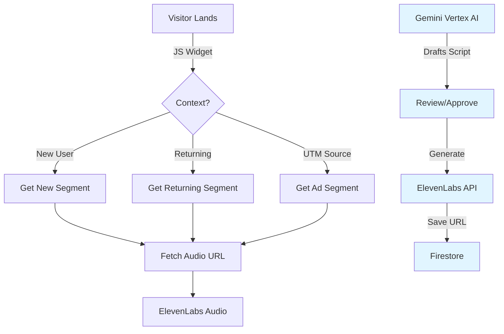

# Voice Hero - Landing Voice Agent 🎙️

**Your homepage, but with a self-optimizing 20-second voice pitch.**

> **Built for the Google Cloud x ElevenLabs Hackathon 2025**  
> *Challenge: ElevenLabs (Conversational, Intelligent, Voice-Driven)*  
> *Powered by: Google Vertex AI (Gemini) + ElevenLabs AI Voice*

[](https://voicehero.prodfact.com)
[](https://github.com/esatemre/voice-hero)

**🎯 Try it live:** [voicehero.prodfact.com](https://voicehero.prodfact.com) | **📖 Demo Page:** [voicehero.prodfact.com/demo.html](https://voicehero.prodfact.com/demo.html)

## 🚀 The Problem
You fight for every click to your homepage. But once visitors arrive, they all see the same static headline.
- **First-time visitors** are confused.
- **Returning visitors** are bored.
- **Ad traffic** hears a generic pitch that doesn't match the ad they clicked.

Static text doesn't adapt. **Voice does.**

## 💡 The Solution
Voice Hero is a Landing Voice Agent that turns website homepages into conversational, intelligent voice experiences.

**How it works:**
1. **Detects** who the visitor is (New, Returning, location, ad source) using real-time context
2. **Generates** tailored voice scripts using **Google Vertex AI (Gemini Pro)** as an expert copywriter
3. **Synthesizes** natural speech using **ElevenLabs' 500+ realistic AI voices** (available in 29+ languages)
4. **Learns** from engagement metrics to continuously improve scripts and maximize conversions

Each visitor hears a personalized pitch. Different segments get different voices and messaging. Static text is replaced with adaptive voice.

## 🛠️ Tech Stack

### 1. Google Vertex AI (Gemini) - Intelligent Script Generation
- **Gemini Pro**: Acts as an expert copywriter. Analyzes page content and generates conversion-focused scripts tailored to visitor segments
- **Context-Aware Prompts**: Generates different pitches based on visitor type (new vs returning), audience segment, language, and tone preferences
- **Examples of Generated Scripts**: 
  - "Welcome! Discover how our platform helps brands engage visitors"
  - "Hey! Great to see you back. Check out our new features"
  - "Looking for solutions? See why 10,000+ companies trust us"

### 2. ElevenLabs - Natural, Realistic AI Voice
- **Voice Synthesis**: Use ElevenLabs' Text-to-Speech API with 500+ realistic voices (male, female, different accents and languages)
- **Voice Personas**: Each audience segment can have a distinct voice personality (Professional, Energetic, Calm, Friendly)
- **Multilingual Support**: Generate scripts and voice in 29+ languages for global audiences
- **Audio Quality**: Turbo and High models ensure natural-sounding speech that drives engagement
- **Voice Design**: Pick voices that match your brand tone and resonate with target audiences

### 3. Firebase - Real-Time Data & Feature Flags
- **Firestore Database**: Store website details, segment definitions, and voice preferences
- **Script & Audio Storage**: Keep generated scripts and audio URLs with version history
- **Analytics Events**: Track visitor engagement, plays, completions, and segment performance
- **Real-Time Updates**: Dashboard and widget sync instantly when scripts or voices change
- **Remote Config**: Server-side feature flags for staged rollouts and operational toggles
  - **Server Flags** (cached 60s): `email_onboarding_enabled`, `new_project_creation_enabled`
  - **Safe Defaults**: Missing flags fall back to defaults, ensuring backward compatibility

### 4. Next.js - Scalable Platform
- **Full-Stack Framework**: API routes handle Gemini + ElevenLabs integration
- **Dashboard**: Intuitive web interface for managing pages, segments, scripts, and voices
- **Embedded Widget**: Lightweight JavaScript that loads on any website and plays personalized voice pitches
- **Containerized Deployment**: Deploy using Docker images from GHCR and host with Coolify or any container platform

## 🏗️ Architecture



## ✨ Core Features

- **Automatic Page Discovery**: Widget detects and indexes all pages on your website
- **AI Script Generation**: Gemini generates conversion-optimized scripts for each audience segment
- **Voice Selection**: Choose from 500+ ElevenLabs voices with real-time preview
- **Smart Segmentation**: Target new visitors, returning customers, ad campaigns, language preferences
- **Per-Page Customization**: Different scripts and voices for different pages
- **AI Script Critique**: Get automatic feedback and improvement suggestions for scripts
- **Real-Time Analytics**: Track engagement per page, segment, and voice
- **Test as Visitor**: Preview exactly what each visitor will hear based on their context
- **Multi-Language Support**: Generate scripts and voice in 29+ languages
- **Visitor Simulator**: Test different visitor contexts before going live

## 🚀 Quick Start (3 minutes)

### Prerequisites
- **Node.js** 18+ 
- **Google Cloud Account** (Vertex AI & Firestore enabled)
- **ElevenLabs Account** with API key
- **Firebase Project** with Firestore database

### Installation

1. **Clone the repository**
   ```bash
   git clone https://github.com/esatemre/voice-hero.git
   cd voice-hero
   ```

2. **Install dependencies**
   ```bash
   pnpm install
   ```

3. **Configure Environment Variables**
   
   Copy the example environment file:
   ```bash
   cp apps/web/.env.example apps/web/.env.local
   ```
   
   Fill in your API keys in `apps/web/.env.local`:
   - **ElevenLabs API Key**: Get from [ElevenLabs Dashboard](https://elevenlabs.io/app/voice-lab)
   - **Firebase Config**: Get from [Firebase Console](https://console.firebase.google.com/) > Project Settings
   - **Google Cloud Service Account**: For Vertex AI access (see [docs/SETUP.md](./docs/SETUP.md))
   
   📖 **Detailed setup:** See [docs/SETUP.md](./docs/SETUP.md) for complete API key instructions.

4. **Run the Development Server**
   ```bash
   pnpm run dev
   ```

5. **Open the Dashboard**
   Visit `http://localhost:3000/dashboard` and create your first project!

   🎉 **That's it!** You're ready to generate personalized voice pitches for your website.

## 📚 Documentation

| Document | Description |
|----------|-------------|
| [**INDEX.md**](./docs/INDEX.md) | Documentation hub - start here |
| [**SETUP.md**](./docs/SETUP.md) | Complete setup guide with API keys |
| [**ROADMAP.md**](./docs/ROADMAP.md) | Future features and vision |
| [**architecture.md**](./docs/architecture.md) | System architecture overview |
| [**FIREBASE_FEATURE_FLAGS.md**](./docs/FIREBASE_FEATURE_FLAGS.md) | Feature flags reference |

## 🔮 Roadmap

We have big plans to turn Voice Hero into a fully conversational agent. See [docs/ROADMAP.md](./docs/ROADMAP.md) for our vision of:
- **Two-way voice conversations** with ElevenLabs Conversational AI
- **Reinforcement learning loops** that auto-optimize scripts based on engagement
- **Multi-armed bandit algorithms** for dynamic A/B testing
- **Auto-discovery and adaptation** to content changes

## 🤝 Founder Interest & Early Feedback

Founders we have spoken with want a faster way to sharpen how they explain their product and to make their brand feel more professional as new startups launch every day. Early feedback on VoiceHero has been encouraging, so we plan to keep iterating with humility and curiosity.

## 🏆 Hackathon Submission

**Built for:** Google Cloud x ElevenLabs Hackathon 2025  
**Challenge:** ElevenLabs (Conversational, Intelligent, Voice-Driven)  
**Live Demo:** [voicehero.prodfact.com](https://voicehero.prodfact.com)  
**GitHub:** [github.com/esatemre/voice-hero](https://github.com/esatemre/voice-hero)

## 📄 License

MIT License - See [LICENSE](./LICENSE) file for details.

---

**Made with ❤️ for the Google Cloud x ElevenLabs Hackathon 2025**
